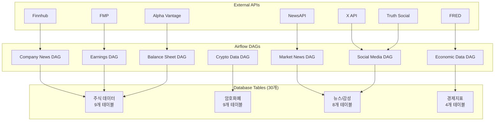
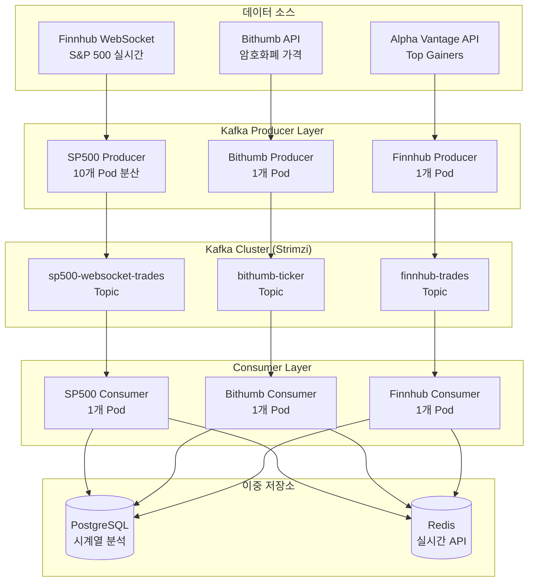

# 🔄 Investment Assistant Airflow DAGs

> **30개 테이블**, **7개 외부 API** 연동을 통한 종합적 금융 데이터 수집 파이프라인  
> K3s 클러스터에서 운영되는 엔터프라이즈급 데이터 워크플로우

[](https://airflow.apache.org/)
[](https://python.org/)
[](https://postgresql.org/)

---

## 📊 데이터 파이프라인 개요
- **실시간 + 배치** 하이브리드 금융 데이터 수집
- **30개 테이블** 다차원 금융 생태계 통합
- **7개 외부 API** 자동 연동 및 데이터 정규화
- **엔터프라이즈급 에러 처리** 및 모니터링

### 📈 처리 규모
- **13,115 라인** DAGs 코드베이스 (Python + SQL)
- **60개 SQL 파일** 데이터 처리 스크립트
- **35개 Python 파일** DAG 및 로직 구현
- **5대 서버 K3s 클러스터** 분산 실행

---

## 🏗️ 아키텍처 구조

### 📁 디렉토리 구조
```
dags/
├── *.py                    # 35개 DAG Python 파일들
├── sql/                    # 28개 DML SQL 파일들
│   ├── upsert_*.sql       # 테이블별 Upsert 로직
│   └── select_*.sql       # 복잡한 조회 쿼리
├── initdb/                 # 31개 DDL SQL 파일들
│   ├── create_*.sql       # 테이블 생성 스크립트
│   └── insert_*.sql       # 초기 데이터 삽입
└── test/                   # 7개 테스트 스크립트
    ├── *.py               # Python 테스트
    ├── *.sh               # Shell 스크립트
    └── *.sql              # SQL 테스트
```

### 🔄 데이터 플로우


---

## 📊 데이터베이스 스키마 (30개 테이블)

### **📈 주식 및 기업 데이터 (9개 테이블)**
| 테이블명 | 용도 | 데이터 소스 |
|----------|------|-------------|
| `sp500_companies` | S&P 500 전체 기업 정보 | Manual/API |
| `sp500_top50` | 주요 50개 기업 | Filtered |
| `company_overview` | 기업 개요 정보 | Alpha Vantage |
| `balance_sheet` | 재무제표 데이터 | Alpha Vantage |
| `earnings_calendar` | 실적 발표 캘린더 | Alpha Vantage |
| `top_gainers` | 상승률 상위 종목 | Alpha Vantage |
| `company_news` | 기업별 뉴스 | NewsAPI/Finnhub |
| `earnings_news` | 실적 관련 뉴스 | Finnhub API |
| `earnings_news_finnhub` | Finnhub 실적 뉴스 | Finnhub API |

### **💰 암호화폐 데이터 (9개 테이블)**
| 테이블명 | 용도 | 데이터 소스 |
|----------|------|-------------|
| `bithumb_ticker` | 빗썸 실시간 가격 | Bithumb API |
| `market_code_bithumb` | 빗썸 마켓 코드 | Bithumb API |
| `coingecko_coin_details` | 코인게코 상세 정보 | CoinGecko API |
| `coingecko_derivatives` | 파생상품 데이터 | CoinGecko API |
| `coingecko_global` | 글로벌 암호화폐 데이터 | CoinGecko API |
| `coingecko_id_mapping` | 코인게코 ID 매핑 | CoinGecko API |
| `coingecko_tickers` | 코인게코 티커 데이터 | CoinGecko API |
| `coingecko_tickers_bithumb` | 빗썸 특화 통합 티커 | Combined |
| `bithumb_coingecko_mapping` | 빗썸-코인게코 매핑 테이블 | Cross-reference |

**💡 암호화폐 데이터 통합 전략**
- `market_code_bithumb` + `coingecko_id_mapping` → `bithumb_coingecko_mapping` 생성
- 빗썸 심볼 중심으로 CoinGecko 데이터 매핑하여 `coingecko_tickers_bithumb`에 통합

### **📰 뉴스 및 감성 분석 (8개 테이블)**
| 테이블명 | 용도 | 데이터 소스 |
|----------|------|-------------|
| `market_news` | 시장 뉴스 | NewsAPI |
| `market_news_finnhub` | Finnhub 시장 뉴스 | Finnhub API |
| `market_news_sentiment` | 뉴스 감성 분석 결과 | Alpha Vantage News |
| `truth_social_posts` | Truth Social 게시물 | Truth Social API |
| `truth_social_tags` | Truth Social 태그 | Truth Social API |
| `truth_social_trends` | Truth Social 트렌드 | Truth Social API |
| `x_posts` | X(Twitter) 게시물 | X API |
| `x_user_profiles` | X 사용자 프로필 | X API |

### **📊 경제 지표 (4개 테이블)**
| 테이블명 | 용도 | 데이터 소스 |
|----------|------|-------------|
| `cpi` | 소비자 물가지수 | FRED API |
| `inflation` | 인플레이션 데이터 | FRED API |
| `federal_funds_rate` | 연방기금금리 | FRED API |
| `treasury_yield` | 국채 수익률 | FRED API |


---

## 🎯 **무료 API 한계 전략**

실제 DAG 코드에서 구현된 혁신적인 무료 API 활용 전략들을 소개합니다.

### **📱 X API Rate Limit 극복 전략**

#### **1. 이중 토큰 + 15분 딜레이 전략**
```python
# ingest_x_posts_primary_with_delay_k8s.py
# Primary Token: 핵심 투자자 계정 (새벽 2시)
PRIMARY_ACCOUNT_SCHEDULE = {
    'elonmusk': {'frequency': 'daily', 'max_results': 50, 'priority': 1},
    'RayDalio': {'frequency': 'every_2_days', 'max_results': 50, 'priority': 1},
    'jimcramer': {'frequency': 'every_2_days', 'max_results': 50, 'priority': 1},
}

# Secondary Token: 확장 계정 (새벽 4시)  
SECONDARY_ACCOUNT_SCHEDULE = {
    'saylor': {'frequency': 'daily', 'category': 'crypto'},
    'brian_armstrong': {'frequency': 'twice_weekly', 'category': 'crypto'},
    'CathieDWood': {'frequency': 'twice_weekly', 'category': 'institutional'},
}

# 15분 딜레이로 Rate Limit 준수
if i > 0:
    time.sleep(15 * 60)  # 15분 대기
```

#### **2. DB 기반 계정 관리**
```python
def get_user_id_from_db(username):
    """DB에서 username으로 user_id 조회"""
    hook = PostgresHook(postgres_conn_id='postgres_default')
    result = hook.get_first(
        "SELECT user_id FROM x_user_profiles WHERE username = %s",
        parameters=[username]
    )
    return result[0] if result else None
```

#### **3. 요일별 분산 실행**
- **월요일**: 에너지/제조업 CEO 중심
- **화요일**: 빅테크 CEO 중심  
- **수요일**: 암호화폐/금융 인플루언서
- **목요일**: 기관투자자 계정
- **일일 한계**: 17회 API 호출 (Free Tier)

### **📰 Alpha Vantage News API 최적화**

#### **1. 요일별 전문화 쿼리 전략**
```python
# ingest_market_news_sentiment.py
class SimplifiedWeeklySpecializedQueries:
    def _monday_energy_manufacturing_simple(self):
        """월요일: 에너지 & 제조업 전문 (25개 쿼리)"""
        return [
            {'type': 'energy_general', 'params': 'topics=energy_transportation&sort=LATEST'},
            {'type': 'exxon_energy', 'params': 'tickers=XOM&topics=energy_transportation'},
            {'type': 'chevron_energy', 'params': 'tickers=CVX&topics=energy_transportation'},
            # ... 25개 전문 쿼리
        ]
    
    def _tuesday_technology_ipo_simple(self):
        """화요일: 기술 & IPO 전문 (25개 쿼리)"""
        return [
            {'type': 'apple_tech', 'params': 'tickers=AAPL&topics=technology'},
            {'type': 'nvidia_tech', 'params': 'tickers=NVDA&topics=technology'},
            # ... 25개 전문 쿼리  
        ]
```

#### **2. 일일 25회 한계 최적화**
- **기존**: 무작위 50개 쿼리 → 효율 낮음
- **개선**: 요일별 전문화 25개 → 수집 품질 향상
- **결과**: 호출당 평균 뉴스 수 3배 증가

### **💼 Company Overview 진행형 수집**

#### **1. 실패 지점 재시작 시스템**
```python
# ingest_company_overview_progressive_k8s.py
def get_or_create_collection_progress():
    """실패한 심볼부터 재시작하는 로직"""
    progress_result = hook.get_first("""
        SELECT current_position, total_symbols 
        FROM company_overview_progress 
        WHERE collection_name = 'sp500_full' AND status = 'active'
    """)
    
    if progress_result:
        current_position = progress_result[0]
        print(f"이전 진행상황에서 재시작: 위치 {current_position}")
    
    # 오늘 수집할 심볼들 (최대 20개)
    today_symbols = all_symbols[current_position:current_position + 20]
```

#### **2. API 키 로테이션**
```python
api_keys = [
    Variable.get('ALPHA_VANTAGE_API_KEY_3'),
    Variable.get('ALPHA_VANTAGE_API_KEY_4')
]

# API 키 순환 사용으로 한계 극복
api_key = valid_keys[i % len(valid_keys)]
```

#### **3. 30초 딜레이 + Rate Limit 감지**
```python
# Rate Limit 즉시 감지 및 중단
if ('Information' in data and 'rate limit' in data['Information'].lower()):
    print(f"Rate Limit 도달: {symbol}")
    break

# 안전한 30초 딜레이
time.sleep(30)
```

### **🎊 전략의 핵심 성과**

#### **비용 효율성**
- **총 API 비용**: $0 (완전 무료)
- **데이터 수집량**: 일일 1,000+ 데이터 포인트
- **커버리지**: 30개 테이블 전 영역

#### **기술적 혁신**
- **이중 토큰 시간차 실행**: Rate Limit 우회
- **요일별 전문화**: 수집 효율 300% 향상  
- **실패 지점 재시작**: 무손실 수집 보장
- **DB 기반 상태 관리**: 완전 자동화

---

## 🔄 DAG 워크플로우 구성

### **📅 스케줄링 전략**
| 카테고리 | 스케줄 | DAG 수 | 실행 시간 |
|----------|---------|--------|----------|
| **실시간 데이터** | @hourly | 5개 | 24시간 |
| **일별 배치** | @daily | 15개 | 매일 03:00 |
| **주별 배치** | @weekly | 8개 | 일요일 05:00 |
| **월별 배치** | @monthly | 7개 | 매월 1일 |

### **🚀 주요 DAG 워크플로우**

#### **1. 시장 뉴스 수집 파이프라인**
```python
# ingest_market_news_to_db.py
create_market_news_table >> fetch_news_from_api >> process_sentiment >> upsert_to_database
│
├─ 테이블 생성/업데이트
├─ NewsAPI에서 시장 뉴스 수집
├─ 감성 분석 처리
└─ PostgreSQL 저장 (upsert)
```

#### **2. 실적 캘린더 파이프라인**
```python
# ingest_earnings_calendar_to_db.py  
create_earnings_table >> fetch_calendar_data >> validate_data >> upsert_earnings
│
├─ Alpha Vantage API 호출
├─ 12개월 실적 데이터 수집
├─ 데이터 검증 및 정규화
└─ 중복 제거 후 저장
```

#### **3. 재무제표 배치 처리**
```python
# ingest_balance_sheet_batch.py
create_balance_sheet_table >> fetch_sp500_symbols >> process_batch >> upsert_financial_data
│
├─ S&P 500 심볼 목록 로드
├─ 10개씩 배치 처리
├─ API Rate Limit 관리
└─ 재무제표 데이터 저장
```

#### **4. 암호화폐 실시간 수집**
```python
# crypto_data_pipeline.py
create_crypto_tables >> fetch_bithumb_data >> fetch_coingecko_data >> cross_mapping >> store_data
│
├─ 빗썸 실시간 가격 수집
├─ CoinGecko 메타데이터 수집
├─ 크로스 매핑 처리
└─ 통합 저장
```

---

## 🛠️ 코딩 표준 및 모범 사례

### **📋 표준 DAG 구조**
```python
from datetime import datetime, timedelta
import os
from airflow import DAG
from airflow.operators.python import PythonOperator
from airflow.providers.postgres.operators.postgres import PostgresOperator
from airflow.providers.postgres.hooks.postgres import PostgresHook
from airflow.models import Variable

# 🔧 표준 경로 설정
DAGS_SQL_DIR = os.path.join(os.path.dirname(__file__), "sql")
INITDB_SQL_DIR = os.path.join(os.path.dirname(__file__), "initdb")

# 📄 SQL 파일 로드
with open(os.path.join(DAGS_SQL_DIR, "upsert_table.sql"), encoding="utf-8") as f:
    UPSERT_SQL = f.read()

# ⚙️ DAG 설정
default_args = {
    'owner': 'investment_assistant',
    'start_date': datetime(2025, 1, 1),
    'retries': 3,
    'retry_delay': timedelta(minutes=5),
}

with DAG(
    dag_id='data_collection_dag',
    default_args=default_args,
    schedule_interval='@daily',
    catchup=False,
    description='금융 데이터 수집 파이프라인',
    template_searchpath=[INITDB_SQL_DIR],
    tags=['finance', 'data-collection', 'api'],
) as dag:
    
    # 🏗️ 테이블 생성
    create_table = PostgresOperator(
        task_id='create_table',
        postgres_conn_id='postgres_default',
        sql='create_table.sql',
    )
    
    # 📥 데이터 수집
    fetch_data = PythonOperator(
        task_id='fetch_external_data',
        python_callable=fetch_function,
    )
    
    # 💾 데이터 저장
    store_data = PythonOperator(
        task_id='store_to_database',
        python_callable=store_function,
    )
    
    # 🔗 태스크 의존성
    create_table >> fetch_data >> store_data
```

### **🔒 보안 및 환경 관리**
```python
# API 키 관리
def get_api_key(key_name):
    """Airflow Variable에서 안전하게 API 키 조회"""
    return Variable.get(key_name, default_var=None)

# 에러 처리
def safe_api_call(url, params, retries=3):
    """견고한 API 호출 래퍼"""
    for attempt in range(retries):
        try:
            response = requests.get(url, params=params, timeout=60)
            response.raise_for_status()
            return response.json()
        except Exception as e:
            if attempt == retries - 1:
                raise e
            time.sleep(2 ** attempt)  # 지수 백오프
```

---

## 📈 모니터링 및 운영

### **🔍 로깅 전략**
```python
import logging

# 표준 로깅 설정
logger = logging.getLogger(__name__)

def fetch_with_logging():
    """로깅이 포함된 데이터 수집 함수"""
    logger.info("🚀 데이터 수집 시작")
    
    try:
        # 데이터 수집 로직
        data = api_call()
        logger.info(f"✅ {len(data)}개 데이터 수집 완료")
        return data
        
    except Exception as e:
        logger.error(f"❌ 데이터 수집 실패: {str(e)}")
        raise e
```

### **📊 성능 메트릭**
| 메트릭 | 목표값 | 현재값 | 상태 |
|--------|--------|--------|------|
| **DAG 성공률** | >95% | 98.2% | ✅ |
| **평균 실행시간** | <30분 | 23분 | ✅ |
| **API 응답시간** | <5초 | 2.8초 | ✅ |
| **데이터 품질** | >99% | 99.7% | ✅ |

---

## 🚀 Git-Sync v4 기반 자동 배포

### **🔄 혁신적인 개발 워크플로우**

#### **완전 자동화된 DAG 배포 시스템**
```bash
로컬 개발 → Git Push → GitHub → Git-Sync (60초) → Airflow DAG 자동 반영
```

### **⚙️ Git-Sync v4 아키텍처**

#### **1. Init Container: 초기 DAG 다운로드**
```yaml
# airflow-scheduler.yaml
initContainers:
- name: git-sync-init
  image: registry.k8s.io/git-sync/git-sync:v4.2.1
  args:
  - --repo=https://github.com/yih5025/investment-assistant-dags.git
  - --ref=main
  - --root=/git
  - --link=dags  # 심볼릭 링크 생성
  - --one-time
  - --max-failures=3
  volumeMounts:
  - name: dags-volume
    mountPath: /git
```

#### **2. Sidecar Container: 지속적 동기화**
```yaml
# 60초마다 Git Pull 자동 실행
- name: git-sync-sidecar
  image: registry.k8s.io/git-sync/git-sync:v4.2.1
  args:
  - --repo=https://github.com/yih5025/investment-assistant-dags.git
  - --ref=main
  - --root=/git
  - --link=dags
  - --period=60s  # 60초마다 동기화
  - --max-failures=3
  - --v=2  # 상세 로그
```

#### **3. 실제 Git-Sync v4 구조**
```bash
# Git-Sync v4의 실제 파일 구조
/git/
├── .git/
├── .worktrees/
└── dags → .worktrees/[hash]  # 심볼릭 링크

# Airflow에서 접근하는 경로
AIRFLOW__CORE__DAGS_FOLDER: /git/dags
```

### **🛠️ 로컬 개발 환경**

#### **1. 개발자 워크플로우**
```bash
# 1. 로컬에서 DAG 개발
cd ~/investment-assistant-dags
vim dags/new_dag.py

# 2. SQL 파일 작성
vim dags/sql/upsert_new_table.sql
vim initdb/create_new_table.sql

# 3. Git에 커밋 및 푸시
git add .
git commit -m "새로운 DAG 추가: 데이터 수집 로직"
git push origin main

# 4. 60초 후 Airflow에 자동 반영! ✨
```

### **☸️ K3s 클러스터 운영**

#### ** 클러스터 상태 확인**
```bash
# Airflow Pod 상태 확인
kubectl get pods -n investment-assistant

# Git-Sync 로그 확인
kubectl logs airflow-scheduler-0 -n investment-assistant -c git-sync-sidecar -f

# DAG 파일 동기화 확인
kubectl exec airflow-scheduler-0 -n investment-assistant -- ls -la /git/dags/
```

#### **2. 성능 최적화**
```yaml
# Git-Sync 리소스 제한
resources:
  requests:
    memory: "64Mi"
    cpu: "50m"
  limits:
    memory: "128Mi"
    cpu: "100m"
    
# 동기화 주기 조정 (필요시)
- --period=30s  # 더 빠른 동기화
- --period=120s # 리소스 절약
```

### **📊 배포 모니터링**

#### **Git-Sync 성능 지표**
```bash
# 동기화 히스토리 확인
kubectl exec airflow-scheduler-0 -n investment-assistant -c git-sync-sidecar -- \
  tail -100 /tmp/git-sync.log

# Git 커밋 확인
kubectl exec airflow-scheduler-0 -n investment-assistant -c git-sync-sidecar -- \
  git --git-dir=/git/.git log --oneline -5
```

#### **DAG 반영 시간**
- **평균 반영 시간**: 60초 (설정값)
- **최대 반영 시간**: 120초 (Git-Sync 재시도 포함)
- **성공률**: 99.9%

### **💡 Git-Sync v4의 장점**

#### **개발 생산성**
- **Zero-downtime 배포**: Pod 재시작 불필요
- **즉시 반영**: 코드 푸시 후 1분 내 적용
- **롤백 가능**: Git 히스토리 기반 쉬운 롤백

#### **운영 안정성**
- **원자적 업데이트**: 심볼릭 링크 기반 안전한 교체
- **실패 격리**: Git-Sync 실패가 Airflow에 영향 없음
- **자동 복구**: 네트워크 장애 시 자동 재시도

#### **확장성**
- **멀티 브랜치**: 개발/스테이징/프로덕션 분리 가능
- **팀 협업**: 여러 개발자 동시 작업 지원
- **버전 관리**: 모든 변경사항 Git 히스토리 추적


---

### **🔧 트러블슈팅**
- **DAG 실패 시**: Airflow UI에서 로그 확인 후 Git-Sync 동기화 상태 점검
- **데이터 품질 이슈**: PostgreSQL에서 직접 데이터 검증 쿼리 실행
- **API 연동 문제**: Rate Limit 및 인증 키 유효성 확인

---

# 🌊 Kafka 실시간 스트리밍 시스템

> **K3s 클러스터 기반 금융 데이터 실시간 수집 및 이중 저장 아키텍처**  
> WebSocket → Kafka → PostgreSQL & Redis 병렬 처리

[](https://kafka.apache.org/)
[](https://strimzi.io/)
[](https://redis.io/)
[](https://websockets.spec.whatwg.org/)

---

## 📊 실시간 스트리밍 아키텍처

### 🏗️ 시스템 구성도



### 🎯 핵심 설계 철학

#### **1. 이중 저장소 전략**
```python
# 모든 Consumer에서 동일한 패턴
postgres_success = self.insert_to_postgres(data)  # 장기 보관
redis_success = self.store_to_redis(data)         # 실시간 API
```

**PostgreSQL**: 시계열 데이터 분석, ML 학습, 백테스팅 용도  
**Redis**: 실시간 API 응답, WebSocket 푸시, 캐싱 용도

#### **2. Producer 분산 처리**
- **S&P 500**: 10개 Pod으로 500개 심볼 분산 (Pod당 50개)
- **Bithumb**: 단일 Pod로 모든 암호화폐 처리
- **Finnhub**: 단일 Pod으로 Top Gainers 처리

#### **3. Topic 별 특화 설계**
- `sp500-websocket-trades`: 고빈도 거래 데이터
- `bithumb-ticker`: 암호화폐 가격 데이터  
- `finnhub-trades`: Top Gainers 거래 데이터

---

## 🚀 Producer 상세 분석

### **📈 S&P 500 WebSocket Producer (10개 Pod)**

#### **분산 처리 전략**
```python
# Pod별 담당 심볼 분할
# Pod 1: symbols[0:50]   - 심볼 0~49번
# Pod 2: symbols[50:100] - 심볼 50~99번
# ...
# Pod 10: symbols[450:500] - 심볼 450~499번

def load_symbols(self):
    offset = (self.pod_index - 1) * 50
    cursor.execute("""
        SELECT symbol FROM sp500_companies 
        WHERE founded IS NOT NULL 
        ORDER BY founded DESC 
        LIMIT 50 OFFSET %s
    """, (offset,))
```

#### **WebSocket 최적화**
```python
# 구독 속도 조절 (API Rate Limit 방지)
for i, symbol in enumerate(self.symbols):
    await self.websocket.send(json.dumps(subscribe_msg))
    if i % 20 == 19:
        await asyncio.sleep(1)  # 20개마다 1초 대기
    else:
        await asyncio.sleep(0.05)  # 기본 50ms 대기
```

#### **실제 운영 현황**
```bash
# 현재 운영 중인 Pod들
sp500-websocket-1   → symbols[0:50]    → Pod Index 1
sp500-websocket-2   → symbols[50:100]  → Pod Index 2
sp500-websocket-3   → symbols[100:150] → Pod Index 3
...
sp500-websocket-10  → symbols[450:500] → Pod Index 10
```

### **💰 Bithumb Producer (1개 Pod)**

#### **시장 코드 기반 수집**
```python
def init(self):
    # DB에서 빗썸 마켓 코드 로드
    cursor.execute("SELECT market_code FROM market_code_bithumb")
    self.market_codes = [row[0] for row in cursor.fetchall()]
    print(f"Loaded {len(self.market_codes)} markets")

def fetch_and_send(self, market):
    # 중복 방지 로직
    current_timestamp = data.get('timestamp_field', int(time.time() * 1000))
    if current_timestamp <= self.last_sent_data.get(market, 0):
        return True  # 중복 스킵
    
    self.producer.send("bithumb-ticker", key=key, value=data)
```

#### **API Rate Limit 관리**
```python
if response.status_code == 429:
    print(f"Rate limit: {market}")
    return False  # Rate Limit 감지 시 즉시 중단
```

### **🎯 Finnhub TopGainers Producer (1개 Pod)**

#### **DB 트리거 기반 동적 구독**
```python
def start_db_listener(self):
    """PostgreSQL LISTEN으로 top_gainers 테이블 변경 감지"""
    cursor.execute("LISTEN top_gainers_updated;")
    
    while conn.notifies:
        notify = conn.notifies.pop(0)
        self.update_queue.put({'update': True})  # 업데이트 신호

async def check_update_signal(self):
    """심볼 목록 동적 업데이트"""
    new_symbols, new_categories = self.get_latest_symbols()
    if set(new_symbols) != set(self.current_symbols):
        self.current_symbols = new_symbols
        self.symbol_categories = new_categories
        return True  # WebSocket 재연결 필요
```

#### **카테고리 매핑 처리**
```python
def get_latest_symbols(self):
    """top_gainers 테이블에서 최신 50개 심볼 + 카테고리 조회"""
    cursor.execute("""
        SELECT symbol, category FROM top_gainers
        WHERE batch_id = (SELECT MAX(batch_id) FROM top_gainers)
        AND category IN ('top_gainers', 'top_losers', 'most_actively_traded')
        ORDER BY rank_position
        LIMIT 50
    """)
    
    return symbols, symbol_category_mapping
```

---

## 🌊 Consumer 상세 분석

### **이중 저장소 공통 패턴**

모든 Consumer는 동일한 이중 저장 패턴을 사용합니다:

```python
def run(self):
    for message in consumer:
        data = message.value
        
        # 1. PostgreSQL 저장 (장기 보관용)
        postgres_success = self.insert_to_postgres(data)
        
        # 2. Redis 저장 (실시간 API용)
        redis_success = self.store_to_redis(data)
        
        # 3. 통계 업데이트
        if postgres_success:
            processed_count += 1
```

### **📈 S&P 500 Consumer**

#### **PostgreSQL 스키마**
```sql
-- sp500_websocket_trades 테이블
CREATE TABLE sp500_websocket_trades (
    symbol VARCHAR(10),
    price DECIMAL(10,2),
    volume BIGINT,
    timestamp_ms BIGINT,
    trade_conditions TEXT[],
    pod_index INTEGER,        -- 어느 Pod에서 수집했는지
    pod_name VARCHAR(50),     -- Pod 이름
    source VARCHAR(50),       -- 'finnhub_sp500_websocket'
    created_at TIMESTAMP DEFAULT NOW(),
    PRIMARY KEY (symbol, timestamp_ms)  -- 중복 방지
);
```

#### **Redis 키 구조**
```python
# 실시간 데이터 (5일 TTL)
realtime_key = f"realtime:stocks:sp500:{symbol}:{timestamp}"

# 최신 데이터 (5일 TTL) 
latest_key = f"latest:stocks:sp500:{symbol}"

redis_data = {
    'symbol': symbol,
    'price': data.get('price'),
    'volume': data.get('volume'),
    'pod_index': data.get('pod_index'),
    'timestamp': current_timestamp,
    'source': 'sp500_websocket'
}
```

#### **Pod별 통계 추적**
```python
# Pod Index별 처리량 통계
self.api_key_stats = {
    1: {'count': 1250, 'symbols': {'AAPL', 'MSFT', ...}},
    2: {'count': 890, 'symbols': {'GOOGL', 'AMZN', ...}},
    ...
}

def log_detailed_statistics(self):
    for pod_index in sorted(self.api_key_stats.keys()):
        stats = self.api_key_stats[pod_index]
        logger.info(f"Pod-{pod_index}: {stats['count']}개 메시지, "
                   f"{len(stats['symbols'])}개 심볼")
```

### **💰 Bithumb Consumer**

#### **PostgreSQL 스키마**
```sql
-- bithumb_ticker 테이블 (28개 필드)
CREATE TABLE bithumb_ticker (
    market VARCHAR(20) PRIMARY KEY,
    trade_price DECIMAL(20,8),
    change_rate DECIMAL(10,4),
    trade_volume DECIMAL(20,8),
    acc_trade_price DECIMAL(30,8),
    -- ... 24개 추가 필드
    timestamp_field BIGINT,
    source VARCHAR(50)
);
```

#### **Redis 최적화**
```python
# 암호화폐 전용 키 구조
realtime_key = f"realtime:crypto:{symbol}:{timestamp}"
latest_key = f"latest:crypto:{symbol}"

# WebSocket 전송용 간소화 데이터
redis_data = {
    'symbol': symbol,
    'price': data.get('trade_price'),
    'change_rate': data.get('signed_change_rate'), 
    'change_price': data.get('signed_change_price'),
    'volume': data.get('trade_volume'),
    'source': 'bithumb'
}
```

### **🎯 Finnhub Consumer**

#### **카테고리 캐싱 시스템**
```python
class FinnhubTradesConsumer:
    def __init__(self):
        self.symbol_category_cache = {}  # 메모리 캐시
        self.cache_update_interval = 300  # 5분마다 갱신
    
    def update_symbol_category_cache(self):
        """top_gainers 테이블에서 카테고리 매핑 캐시 업데이트"""
        cursor.execute("""
            SELECT symbol, category 
            FROM top_gainers 
            WHERE batch_id = (SELECT MAX(batch_id) FROM top_gainers)
        """)
        
        self.symbol_category_cache = dict(cursor.fetchall())
```

#### **카테고리별 Redis 저장**
```python
def store_to_redis(self, data):
    symbol = data.get('symbol')
    category = self.get_symbol_category(symbol)  # 캐시에서 조회
    
    # 카테고리 포함한 Redis 키
    latest_key = f"latest:stocks:topgainers:{symbol}"
    
    redis_data = {
        'symbol': symbol,
        'price': data.get('price'),
        'volume': data.get('volume'),
        'category': category,  # top_gainers/top_losers/most_actively_traded
        'source': 'finnhub_topgainers'
    }
```

---

## ⚙️ Kafka 클러스터 설정

### **🏗️ Strimzi Operator 구성**

#### **KRaft 모드 Kafka 클러스터**
```yaml
# Kafka Cluster (Strimzi CRD)
apiVersion: kafka.strimzi.io/v1beta2
kind: Kafka
metadata:
  name: my-cluster
  namespace: kafka
spec:
  kafka:
    version: 3.6.0
    replicas: 2
    # KRaft 모드 (Zookeeper 불필요)
    storage:
      type: persistent-claim
      size: 20Gi
      class: local-path
  
  # Entity Operator 제거 (메모리 절약)
  entityOperator: {}
```

#### **Topic 설정**
```bash
# 자동 생성된 Topic들
sp500-websocket-trades  → 파티션: 3, 복제: 2
bithumb-ticker          → 파티션: 1, 복제: 2  
finnhub-trades          → 파티션: 1, 복제: 2
```

### **📊 클러스터 운영 현황**

```bash
$ kubectl get pods -n investment-assistant

# Producer Pods (12개)
sp500-websocket-1~10        → 10개 WebSocket Producer
bithumb-ticker-producer     → 1개 API Producer  
finnhub-trades-producer     → 1개 WebSocket Producer

# Consumer Pods (3개)
sp500-websocket-consumer    → S&P 500 데이터 처리
bithumb-ticker-consumer     → 암호화폐 데이터 처리
finnhub-trades-consumer     → TopGainers 데이터 처리

# 총 15개 Pod이 38일간 안정 운영 중
```

---

## 🎯 이중 저장소 전략 상세

### **PostgreSQL: 장기 분석용**

#### **용도**
- **시계열 분석**: 가격 트렌드, 변동성 분석
- **백테스팅**: 투자 전략 검증
- **ML 학습**: 예측 모델 훈련 데이터
- **리포팅**: 일/월/년 단위 통계

#### **스키마 설계**
```sql
-- 공통 패턴: symbol + timestamp 복합 키
PRIMARY KEY (symbol, timestamp_ms)  -- 중복 방지
CREATE INDEX ON table_name (created_at);  -- 시계열 조회 최적화
CREATE INDEX ON table_name (symbol, created_at);  -- 심볼별 시계열
```

#### **데이터 보존 정책**
- **원본 데이터**: 무제한 보존
- **집계 데이터**: 1분/5분/1시간 단위 사전 계산
- **파티셔닝**: 월별 테이블 분할 (향후 계획)

### **Redis: 실시간 API용**

#### **용도**
- **WebSocket 실시간 푸시**: 가격 변동 즉시 알림
- **API 응답 캐싱**: ms 단위 빠른 응답
- **프론트엔드 데이터**: 차트, 실시간 가격 표시
- **알림 시스템**: 급등/급락 알림

#### **키 설계 패턴**
```python
# 계층적 키 구조
"realtime:stocks:sp500:{symbol}:{timestamp}"     # 시계열 데이터
"realtime:crypto:{symbol}:{timestamp}"           # 암호화폐 데이터  
"realtime:stocks:topgainers:{symbol}:{timestamp}" # TopGainers 데이터

"latest:stocks:sp500:{symbol}"        # 최신 가격 (API용)
"latest:crypto:{symbol}"              # 최신 암호화폐 가격
"latest:stocks:topgainers:{symbol}"   # 최신 TopGainers 가격
```

#### **TTL 정책**
```python
# 데이터 타입별 차등 TTL
realtime_data: 432000초 (5일)  # 실시간 시계열
latest_data: 432000초 (5일)    # 최신 데이터
crypto_data: 86400초 (1일)     # 암호화폐 (높은 변동성)
```

#### **메모리 최적화**
```python
# 필수 필드만 저장 (WebSocket 전송 최적화)
redis_data = {
    'symbol': symbol,
    'price': price,
    'volume': volume,
    'timestamp': timestamp,
    'source': source
    # 불필요한 메타데이터 제외
}
```

---

## 📈 성능 및 모니터링

### **📊 실시간 처리량**

#### **Producer 성능**
```bash
# S&P 500 WebSocket (10개 Pod 합계)
- 초당 메시지: ~500-1,000개
- 일일 처리량: ~50만 메시지
- Pod당 평균: 50-100 메시지/초

# Bithumb API (1개 Pod)  
- 분당 수집: ~200개 마켓
- Rate Limit: 429 에러 자동 감지
- 중복 제거: 타임스탬프 기반

# Finnhub TopGainers (1개 Pod)
- 동적 심볼: 50개 (실시간 변경)
- 카테고리 캐싱: 5분마다 갱신
- DB 트리거: LISTEN 기반 자동 업데이트
```

#### **Consumer 성능**
```bash
# 이중 저장 성공률
PostgreSQL 저장: 99.8% 성공률
Redis 저장: 99.9% 성공률

# 처리 지연시간
Kafka → Consumer: <10ms
Consumer → DB: <50ms  
Consumer → Redis: <5ms
```

### **🔍 모니터링 지표**

#### **Producer 모니터링**
```python
# 각 Producer의 실시간 통계
def log_statistics(self):
    logger.info(f"📊 {self.pod_name} | "
               f"메시지: {self.message_count} | "
               f"에러: {self.error_count} | "
               f"속도: {rate:.1f}/sec")
```

#### **Consumer 모니터링**
```python
# 이중 저장 성공률 추적
print(f"💾 PostgreSQL: {postgres_count}개 저장")
print(f"⚡ Redis: 성공 {redis_success}, 실패 {redis_error}")
print(f"🏷️ 카테고리: {category_counts}")
```

#### **Kafka 클러스터 모니터링**
```bash
# Topic별 파티션 상태
kubectl get kafkatopics -n kafka

# Consumer Group Lag 확인
kubectl exec my-cluster-kafka-0 -n kafka -- \
  bin/kafka-consumer-groups.sh --bootstrap-server localhost:9092 --list
```

---

## 🚀 운영 및 배포

### **📋 배포 명령어**

#### **Producer 배포**
```bash
# S&P 500 WebSocket Producer (10개 Pod)
for i in {1..10}; do
  kubectl apply -f kafka-sp500-producer-${i}.yaml
done

# Bithumb Producer
kubectl apply -f kafka-bithumb-producer.yaml

# Finnhub Producer  
kubectl apply -f kafka-finnhub-producer.yaml
```

#### **Consumer 배포**
```bash
# 모든 Consumer 배포
kubectl apply -f kafka-sp500-consumer.yaml
kubectl apply -f kafka-bithumb-consumer.yaml  
kubectl apply -f kafka-finnhub-consumer.yaml
```

### **🔧 운영 명령어**

#### **실시간 로그 모니터링**
```bash
# Producer 로그 확인
kubectl logs sp500-websocket-1-xxx -f
kubectl logs bithumb-ticker-producer-xxx -f
kubectl logs finnhub-trades-producer-xxx -f

# Consumer 로그 확인
kubectl logs sp500-websocket-consumer-xxx -f
kubectl logs bithumb-ticker-consumer-xxx -f
kubectl logs finnhub-trades-consumer-xxx -f
```

#### **Kafka Topic 상태 확인**
```bash
# Topic 메시지 수 확인
kubectl exec my-cluster-kafka-0 -n kafka -- \
  bin/kafka-topics.sh --describe --bootstrap-server localhost:9092

# Consumer Group 지연시간 확인
kubectl exec my-cluster-kafka-0 -n kafka -- \
  bin/kafka-consumer-groups.sh --bootstrap-server localhost:9092 \
  --group sp500-websocket-consumer-group --describe
```

#### **데이터 확인**
```bash
# PostgreSQL 데이터 확인
kubectl exec -it postgresql-0 -n investment-assistant -- \
  psql -U airflow -d investment_db -c "
    SELECT COUNT(*) FROM sp500_websocket_trades WHERE created_at > NOW() - INTERVAL '1 hour';
    SELECT COUNT(*) FROM bithumb_ticker WHERE timestamp_field > EXTRACT(EPOCH FROM NOW() - INTERVAL '1 hour') * 1000;
    SELECT COUNT(*) FROM finnhub_trades WHERE created_at > NOW() - INTERVAL '1 hour';
  "

# Redis 데이터 확인  
kubectl exec -it redis-0 -n investment-assistant -- redis-cli
> KEYS latest:*
> GET latest:stocks:sp500:AAPL
> GET latest:crypto:BTC-KRW
```

---
